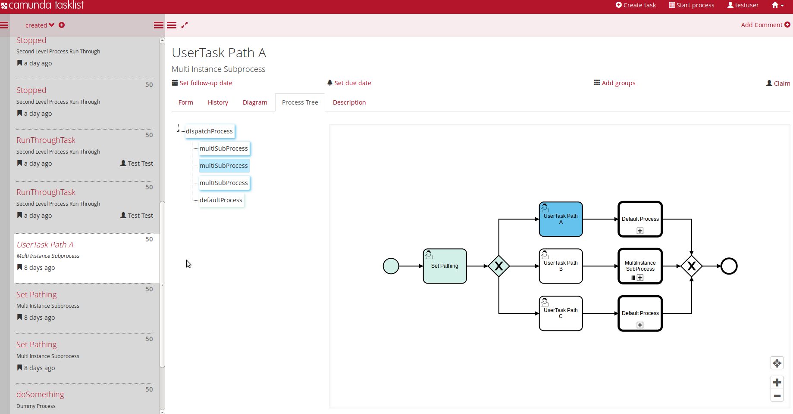

# Camunda Tasklist Processtree Plugin
A plugin for the task list which visualizes a process tree of the process instance hierarchies based on the call activity dependencies.

This plugin shows running and completed process instances in different colors:

* running: BLUE
* incidents: RED
* finished: GREEN

## Show me the important parts!
Take a look at the new tab "Process Tree" after opening a Usertask inside the camunda tasklist:

## How to use it?
### Build from Source
You can use `ant` to build and install the plugin to an existing Cockpit
inside an application server.
For that to work you need to copy the file `build.properties.example` to `build.properties`
and configure the path to your application server inside it.
Alternatively, you can also copy it to `${user.home}/.camunda/build.properties`
to have a central configuration that works with all projects generated by the
[Camunda BPM Maven Archetypes](http://docs.camunda.org/latest/guides/user-guide/#process-applications-maven-project-templates-archetypes).

Once you installed the plugin it should appear in
[Camunda Cockpit](http://docs.camunda.org/latest/guides/user-guide/#cockpit).

### Install from camunda plugin store
Visit the [camunda Plugin Store](http://camunda.org/plugins/) and follow the installation instructions.

## More information
[How to install a Cockpit plugin](http://docs.camunda.org/latest/real-life/how-to/#cockpit-how-to-develop-a-cockpit-plugin-integration-into-cockpit)

[How to develop a Cockpit plugin](http://docs.camunda.org/latest/real-life/how-to/#cockpit-how-to-develop-a-cockpit-plugin)

This project has been generated by the Maven archetype
[camunda-archetype-cockpit-plugin-7.3.1](http://docs.camunda.org/latest/guides/user-guide/#process-applications-maven-project-templates-archetypes).

Discover more Cockpit plugins in the
[Camunda Plugin Store](http://camunda.org/plugins/)

## Environment Restrictions
* Built and tested against Camunda BPM version 7.3.0.

## Known Limitations
* Works only inside the camunda tasklist

## Contributors
The Software Development Team of [WDW eLab GmbH](http://www.wde-elab.de) is responsible for the Design and Implementation of this plugin.

WDW eLab GmbH is an innovative IT company and has great experience with complex business support processes in a complex IT environment. One of our specialities are customer support processes in telecommunication. 

We are proud to be an official camunda partner!

Feel free to contact us via [Email](kontakt@wdw-elab.de)

## License
[Apache License, Version 2.0](http://www.apache.org/licenses/LICENSE-2.0).
